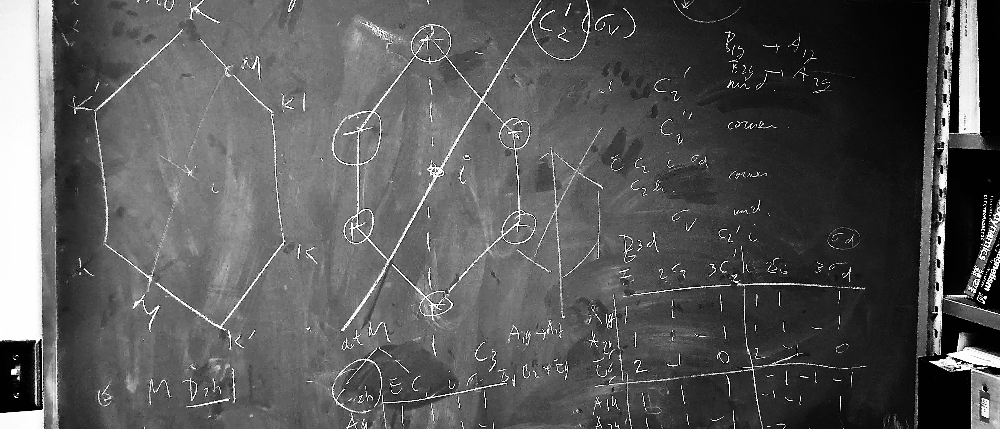

 

### Hi there 👋

My interest ranges from [topological physics](https://en.wikipedia.org/wiki/Topological_order) 🪢 to [carnatic music](https://en.wikipedia.org/wiki/Carnatic_music)🎻. I currently work at the very exciting intersection of quantum computing and machine learning. 

Here are two of works that might interest you 🗿: 

- [Can you use quantum computers to price call and put stock options ? - arXiv:2101.04280](https://arxiv.org/abs/2101.04280)
- [How mathamatically bad (or good?) is it to be vague on your stance in political elections ? - arXiv:2009.05198](https://arxiv.org/abs/2009.05198)
<!--
**santoshkumarradha/santoshkumarradha** is a ✨ _special_ ✨ repository because its `README.md` (this file) appears on your GitHub profile.

Here are some ideas to get you started:

- 🔭 I’m currently working on ...
- 🌱 I’m currently learning ...
- 👯 I’m looking to collaborate on ...
- 🤔 I’m looking for help with ...
- 💬 Ask me about ...
- 📫 How to reach me: ...
- 😄 Pronouns: ...
- ⚡ Fun fact: ...
-->
